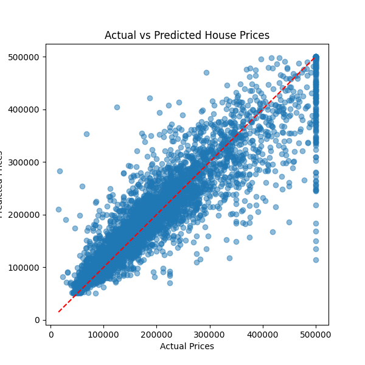
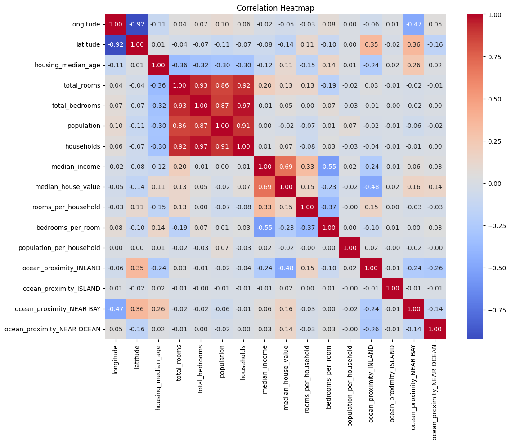

# 🏠 House Price Prediction (Machine Learning Project)

## 📊 Overview
This project analyzes housing data and builds machine learning models to predict house prices based on key features.

---

## 🧠 Models Used
- Linear Regression
- Random Forest Regressor

---

## ⚙️ Data Processing
- Handled missing values
- Feature engineering:
  - Rooms per household
  - Bedrooms per room
  - Population per household
- Converted categorical variables

---

## 📈 Model Performance

| Model | R² Score |
|------|--------|
| Linear Regression | ~0.59 |
| Random Forest | ~0.80 |

👉 Random Forest performs significantly better.

---

## 📊 Visualizations

### 🔹 Actual vs Predicted

### 🔹 Error Distribution

### 🔹 Feature Importance

### 🔹 Correlation Heatmap

### 📊 House Price Distribution

### 📈 Income vs Price

---

## 📁 Dataset
- King County Housing Dataset (USA)
- Contains housing features such as location, numbers of rooms, income, and price.

---

## 🚀 Conclusion
The Random Forest model significantly outperformed Linear Regression, achieving a higher R² score and better capturing complex, nonlinear relationships in the data.

This suggests that housing prices are influenced by multiple interacting factors, making ensemble models like Random Forest more suitable for accurate prediction.

---

## 👤 Author
Ruel Laranjo  
Aspiring Data Scientist | Machine Learning & Data Analysis
